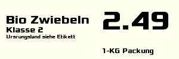

# OpenESL Image Renderer & Templating Engine

## Description
This project aims to provide an open source alternative to the established companies that offer ESL (electronic price label) solutions.
For now, it can only generate images based on a template. Later there will be a templating engine for creating those templates
and even later, there will be a way to save and distribute those images to some form of hardware that can display them

## Preview

```json
{
    "width": 300,
    "height": 100,
    "background": [255, 255, 240, 255],
    "text": [
        {
            "content": "Bio Zwiebeln",
            "color": [0, 0, 0, 255],
            "size": 20,
            "x": 10,
            "y": 40
        },
        [...]
}
```


## Prerequisits
[x] Go 1.23+
[x] Nats 2.10.25

## How to run
Start Nats with jetstream enabled for persistent storage
```shell
docker run --network=host -d nats:latest -js
```

Start the program
```shell
go run .
```

## TODOS:
fix color representation in json, make it look nicer, use hex if possible

## Roadmap
* Improve Image generation speed (multithreading, image size)
* Make service deployable as a container
* Frontend template engine for creating template.jsons (wysiwyg)
* Hardware to display images as eink displays and way to communicate image to hardware

## Contributins
Pull requests are welcome